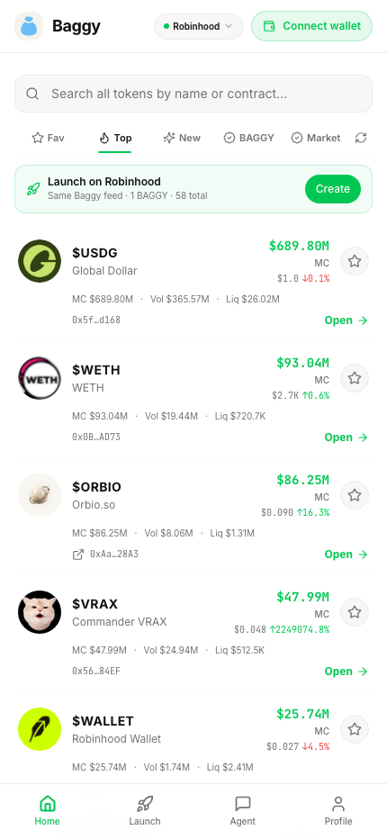
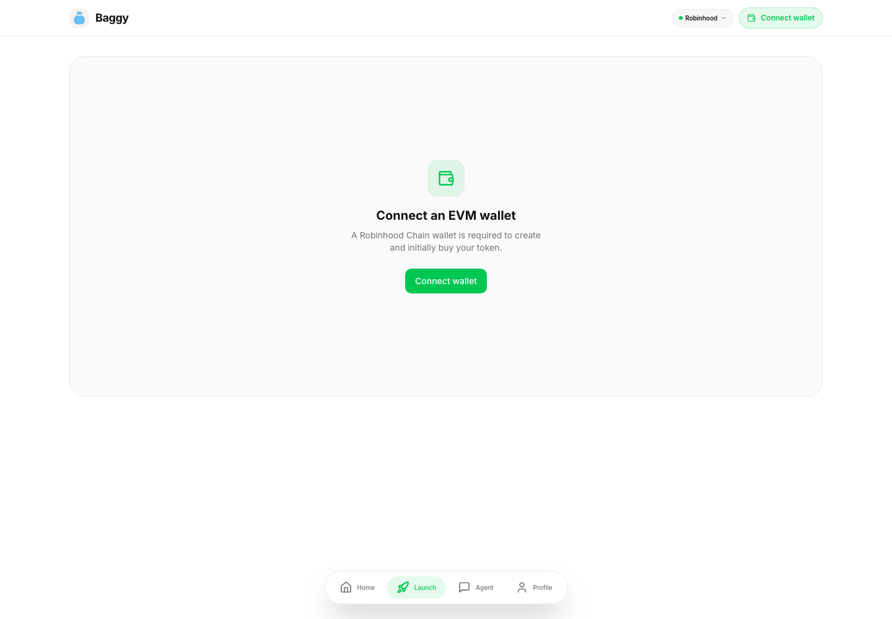
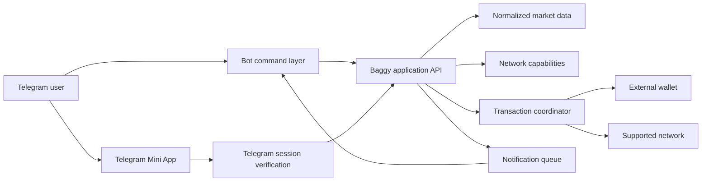
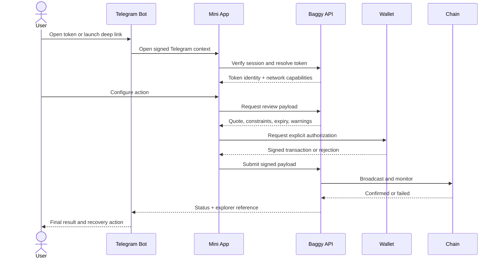

<p align="center">
  
</p>

# Baggy Telegram Bot

**A Telegram-native gateway to multi-chain token discovery, launches, trading workflows, and portfolio context.**

[Open the bot](https://t.me/BaggyApp_bot) · [Baggy web app](https://baggyapp.win) · [X](https://x.com/BaggyApp)

Baggy Telegram Bot brings the shortest Baggy workflows into the place where crypto communities already coordinate. A user can discover a token from a message, open its market context, connect a wallet, prepare an action, and return to the conversation without rebuilding context across several unrelated tools.

> This is a public product and engineering showcase. Production source code, bot credentials, contract configuration, provider routes, and transaction internals remain private.

## The problem

Telegram is often where a token is first discovered, but verification and execution usually happen elsewhere. That creates a fragile sequence of copied contract addresses, wrong-network mistakes, duplicate token pages, and unclear wallet prompts.

The bot reduces that friction by keeping four things connected:

1. **Discovery** — search by token name, symbol, or contract.
2. **Context** — show the network, identity, valuation, liquidity, and source.
3. **Action** — open a focused launch or trade flow only when the network supports it.
4. **Return** — bring the user back to Telegram with a clear result and explorer reference.

## Product preview

<table>
  <tr>
    <td width="48%" valign="top">
      
      <strong>Telegram workspace</strong><br />
      Mobile-first discovery keeps network, search, filters, token identity, valuation, and liquidity in one reading path.
    </td>
    <td width="52%" valign="top">
      
      <strong>Token discovery</strong><br />
      The same data hierarchy scales to a denser market view without changing the meaning of controls or metrics.
    </td>
  </tr>
  <tr>
    <td colspan="2" valign="top">
      
      <strong>Guided launch flow</strong><br />
      A focused sequence turns metadata, network requirements, wallet authorization, and progress into visible steps.
    </td>
  </tr>
</table>

The Telegram surface is intentionally compact, but it preserves the same information order as the main Baggy product. A user can move between discovery and execution without learning a second interface vocabulary.

## Core user flows

| Flow | User outcome |
| --- | --- |
| Start | Understand what the bot can do and open the Mini App |
| Search | Resolve a symbol or contract to the correct token and network |
| Discover | Scan top, new, favorite, and ecosystem-specific tokens |
| Token details | Review identity, market data, source, and supported actions |
| Launch | Prepare metadata and continue through a wallet-signed flow |
| Trade | Review a quote, open the wallet, and follow transaction status |
| Portfolio | Return to balances, positions, and recent activity |
| Alerts | Receive concise, user-controlled updates without feed spam |

## Why a bot and a Mini App

Chat commands work well for intent, links, and notifications. They are less effective for comparing many tokens or reviewing dense market data. Baggy therefore uses two complementary surfaces:

- **Bot messages** for entry points, deep links, confirmations, alerts, and recovery.
- **Telegram Mini App** for search, lists, token context, launch forms, and transaction progress.

This split keeps conversations readable while giving data-heavy tasks enough visual structure.

## Interaction design

| UI decision | Reasoning |
| --- | --- |
| Visible network selector | Token addresses and available actions depend on the selected ecosystem. Network context must never be implicit. |
| Search at the top | Pasting a contract is the fastest and safest route for an experienced user. |
| Stable filter row | Top, new, favorites, and market views remain recognizable modes of one feed. |
| One-column token list | Telegram is primarily mobile; one reading direction protects token identity and valuation from truncation. |
| One primary action per item | A compact surface should not force users to distinguish several equally loud buttons. |
| Wallet gate before execution | The product explains connection or network requirements before the user enters a long flow. |
| Explicit pending states | Quoting, awaiting signature, submitted, confirmed, rejected, and failed are different outcomes. |
| Explorer handoff | Every submitted transaction should have an independent verification path. |
| Restrained notifications | Alerts are opt-in, rate-limited, and grouped to avoid turning utility into noise. |

## Information hierarchy

Every token result answers the same questions in the same order:

1. **Is this the correct asset?** Image, symbol, name, network, and shortened contract.
2. **What is happening?** Price or capitalization and directional change.
3. **Can the market support an action?** Liquidity, volume, and available venue.
4. **What can I do here?** Open the focused token workspace.

This hierarchy is deliberately shared with the Baggy web application, so Telegram feels like another surface of the same product instead of a separate product to relearn.

## High-level architecture



The bot and Mini App share product models but have different delivery responsibilities. Telegram updates are handled quickly and idempotently; market reads and transaction preparation stay behind the application boundary.

## End-to-end execution logic

The most sensitive user journey is not treated as one long request. It is split into recoverable stages with a visible result at every boundary.



1. **Resolve intent.** A command, search, or deep link is converted into a typed product intent.
2. **Verify context.** The server validates Telegram session data and restores the correct account scope.
3. **Normalize identity.** The token and network are resolved before any action is shown.
4. **Check capabilities.** The interface exposes only flows supported by that network and wallet combination.
5. **Build a review.** Quotes, constraints, expiry, and warnings are frozen into an explicit confirmation state.
6. **Request authorization.** The external wallet remains the signing authority.
7. **Track execution.** Submission, confirmation, rejection, expiry, and failure are separate states.
8. **Return evidence.** Telegram receives a concise result with an explorer link or a recovery action.

## Selected engineering decisions

### Verified Telegram sessions

The Mini App does not trust profile fields sent by the browser. Telegram initialization data is validated server-side before account context is created or restored. Validation is time-bounded to reduce replay risk.

### Idempotent update handling

Telegram may retry an update when a response is delayed. Each update is therefore processed against a stable identifier so a repeated delivery cannot create duplicate alerts, launch attempts, or state transitions.

### Capability-driven networks

Not every ecosystem supports the same discovery, wallet, launch, or trading flow. The UI receives an explicit capability set and only presents actions the selected network can complete.

### Normalized token identity

Provider payloads are converted into one token record before rendering. Symbol, name, image, contract, network, price, market capitalization, liquidity, source, and freshness remain separate fields. Missing values stay missing rather than being replaced with misleading substitutes.

### External wallet authorization

Baggy does not ask users to paste private keys into Telegram. State-changing actions are prepared by Baggy and authorized by a supported external wallet. The bot reports progress but does not become the signing authority.

### Controlled notification delivery

Alerts are queued, deduplicated, and rate-limited. User preferences define the event type and threshold; delivery failures can retry without blocking interactive bot commands.

## UI state map

| State | What the user sees | Primary action |
| --- | --- | --- |
| Disconnected | Wallet requirement and supported ecosystem | Connect wallet |
| Ready | Resolved token, live context, available actions | Continue |
| Loading | Stable layout with local progress feedback | Wait or cancel |
| Reviewing | Amount, quote, fee, expiry, network, and warnings | Confirm in wallet |
| Awaiting signature | Wallet-specific instruction without false completion | Open wallet |
| Submitted | Transaction reference and pending status | View explorer |
| Confirmed | Final amount, network, token, and reference | Return to token |
| Rejected | Clear cancellation with unchanged balances | Try again |
| Failed or expired | Human-readable cause and safe recovery path | Refresh quote |
| Unsupported | Why the action is unavailable on this network | Change network |

The layout does not jump between these states. Labels and actions change inside stable regions, which makes progress easier to understand on a small Telegram viewport.

## Simplified implementation examples

These snippets demonstrate architectural ideas only. They are not copied from production code and contain no credentials, internal endpoints, contract details, or transaction routing logic.

### 1. Validate a Mini App session before using it

```ts
type TelegramSession = {
  userId: string;
  issuedAt: number;
};

async function requireTelegramSession(
  initData: string,
): Promise<TelegramSession> {
  const result = await verifyTelegramInitData(initData);

  if (!result.valid || isExpired(result.authDate)) {
    throw new Error("Invalid Telegram session");
  }

  return {
    userId: String(result.user.id),
    issuedAt: result.authDate,
  };
}
```

**Why:** identity comes from verified Telegram data, not editable browser state.

### 2. Make repeated Telegram updates harmless

```ts
async function handleUpdate(update: TelegramUpdate) {
  const accepted = await updateStore.claim(update.updateId);

  if (!accepted) return;

  const intent = parseIntent(update);
  await dispatchIntent(intent);
}
```

**Why:** network retries should not duplicate user-visible or financial actions.

### 3. Render only actions supported by the selected network

```ts
type Capabilities = {
  discovery: boolean;
  launch: boolean;
  trade: boolean;
  portfolio: boolean;
};

function TokenActions({ capabilities }: { capabilities: Capabilities }) {
  return (
    <nav>
      {capabilities.discovery && <OpenToken />}
      {capabilities.launch && <LaunchToken />}
      {capabilities.trade && <ReviewTrade />}
    </nav>
  );
}
```

**Why:** users do not encounter controls that cannot succeed on the active network.

### 4. Keep notification rules explicit

```ts
type AlertRule = {
  tokenId: string;
  kind: "price" | "volume" | "liquidity";
  threshold: number;
  cooldownMinutes: number;
};

function shouldNotify(rule: AlertRule, event: MarketEvent): boolean {
  return matchesThreshold(rule, event) && !isCoolingDown(rule, event.userId);
}
```

**Why:** notifications remain useful only when conditions and cooldowns are predictable.

### 5. Model execution as transitions, not button callbacks

```ts
type ActionState =
  | { status: "ready" }
  | { status: "reviewing"; review: TradeReview }
  | { status: "awaiting_signature"; reviewId: string }
  | { status: "submitted"; txHash: string }
  | { status: "confirmed"; txHash: string }
  | { status: "failed"; reason: string; recoverable: boolean };

function transition(state: ActionState, event: ActionEvent): ActionState {
  if (state.status === "reviewing" && event.type === "SIGN_REQUESTED") {
    return { status: "awaiting_signature", reviewId: state.review.id };
  }

  if (event.type === "SUBMITTED") {
    return { status: "submitted", txHash: event.txHash };
  }

  return reduceTerminalOrRecoveryState(state, event);
}
```

**Why:** a transaction can be retried, rejected, expire, or outlive the Mini App session. Explicit transitions keep the UI and bot messages consistent.

### 6. Preserve data provenance during normalization

```ts
type TokenSnapshot = {
  identity: TokenIdentity;
  marketCap?: number;
  liquidity?: number;
  source: "indexer" | "dex" | "onchain";
  observedAt: string;
};

function toSnapshot(payload: ProviderToken): TokenSnapshot {
  return {
    identity: normalizeIdentity(payload),
    marketCap: finiteOrMissing(payload.marketCap),
    liquidity: finiteOrMissing(payload.liquidityUsd),
    source: mapProviderSource(payload.provider),
    observedAt: payload.timestamp,
  };
}
```

**Why:** a missing market cap is not silently replaced with FDV or liquidity. Source and freshness travel with the value so the interface can explain what it displays.

## UI system

The visual system is built for repeated scanning rather than decorative browsing:

- **Typography:** compact display type establishes hierarchy; tabular numerals keep changing market values aligned.
- **Color:** restrained neutral surfaces carry most of the interface; accent colors communicate state and action, not decoration.
- **Spacing:** repeated vertical rhythm separates token identity, market context, and execution controls without nested card clutter.
- **Controls:** network selection, filters, and wallet state stay in predictable positions across discovery and detail views.
- **Feedback:** loading, disabled, pending, success, and failure states are visible in the control that initiated the action.
- **Mobile density:** secondary information collapses before identity, valuation, liquidity, or the primary action is truncated.
- **Safety copy:** wallet and transaction language describes what happens next instead of implying completion too early.

The Telegram experience follows Baggy's core design language, but its density and interaction order are tuned for one-handed mobile use and short sessions.

## State model

| State area | Examples | Owner |
| --- | --- | --- |
| Telegram session | verified user, chat, locale | server session boundary |
| Product context | selected network, active token, current tab | Mini App shell |
| Wallet | account, ecosystem, connection, signature request | wallet adapter |
| Remote data | feed, token details, quote, portfolio | query layer |
| Transaction | review, signature, submission, confirmation | feature state machine |
| Notifications | rule, threshold, cooldown, delivery status | queue and preferences store |

Keeping these responsibilities separate prevents a feed refresh from resetting wallet state or a retried Telegram update from repeating a transaction action.

## Reliability and safety checks

The private production project uses complementary checks around the highest-risk boundaries:

- Telegram session verification and expiry tests;
- duplicate-update and webhook retry tests;
- token identity and provider normalization tests;
- network capability and deep-link routing tests;
- wallet rejection, wrong-network, and interrupted-signature cases;
- transaction state and explorer-reference checks;
- notification deduplication, cooldown, and delivery retry tests;
- manual Telegram, mobile browser, and desktop passes.

## Technology snapshot

| Area | Approach |
| --- | --- |
| Telegram | Bot API and Telegram Mini App |
| Client | React and TypeScript |
| Data | Normalized multi-provider market layer |
| Wallets | External Solana and EVM wallet adapters |
| Delivery | Webhook-oriented bot updates and queued notifications |
| Safety | Verified sessions, idempotency, explicit transaction states |
| Quality | Unit tests, type checks, production builds, and device QA |

## What stays private

This repository intentionally excludes:

- bot tokens, signing secrets, and webhook configuration;
- production source code and internal service contracts;
- smart-contract addresses and deployment parameters;
- provider credentials, routing rules, and fallback priorities;
- transaction construction and protection internals;
- user data, analytics, admin tools, and anti-abuse systems.

The examples in this repository are intentionally illustrative. They show boundaries, state ownership, and failure handling without reproducing deployable production modules.

## Relationship to Baggy

The Telegram bot is not a disconnected side project. It reuses Baggy's product language, network capabilities, normalized token identity, and transaction states while adapting delivery to Telegram. The full Baggy product showcase is available in the [main Baggy repository](https://github.com/0xENTYPER/baggy).

## Author

Built by [@entyper](https://x.com/entyper).
